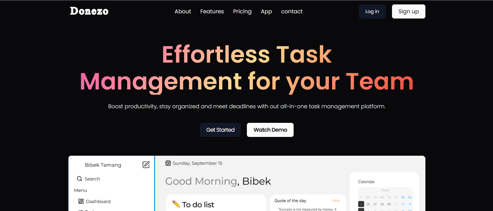
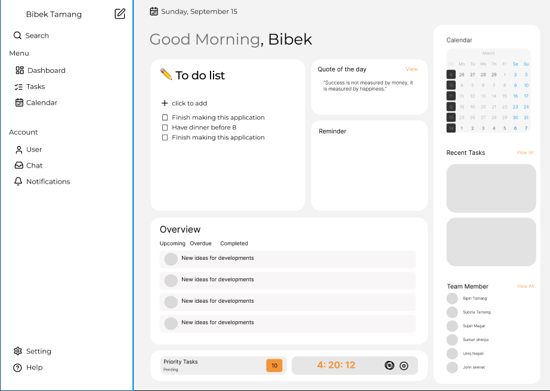

# ✅ Donezo – A Modern Task Management System

Donezo is a powerful and intuitive task management system built to help individuals and teams organize, prioritize, and accomplish their work efficiently. From personal to-dos to full team workflows — stay on track and get things done.

---

## 🔥 Features

- ✅ Create, edit, and delete tasks
- 📅 Set due dates and priorities
- 👥 Assign tasks to team members
- 🏷️ Tag and categorize tasks
- 📊 Visualize tasks in boards (Kanban-style)
- 🔔 Notifications & reminders
- 🔐 Authentication & Role-based access
- 📱 Fully responsive on all devices

---

## ️ Screenshots





## 🚀 Installation

Follow the steps below to run the project locally:

### Note: Setup mongoDB and Redis with docker and Environment variables before running

```bash
# 1. Clone the repository
git clone https://github.com/bibektamang7/DTask.git
cd DTask

# 2. Install client dependencies
cd client
npm install
npm run dev

# 3. Install server dependencies
cd client
npm install
npm run start

#4. Install socker dependencies
cd socket
npm install
npm run start
```
